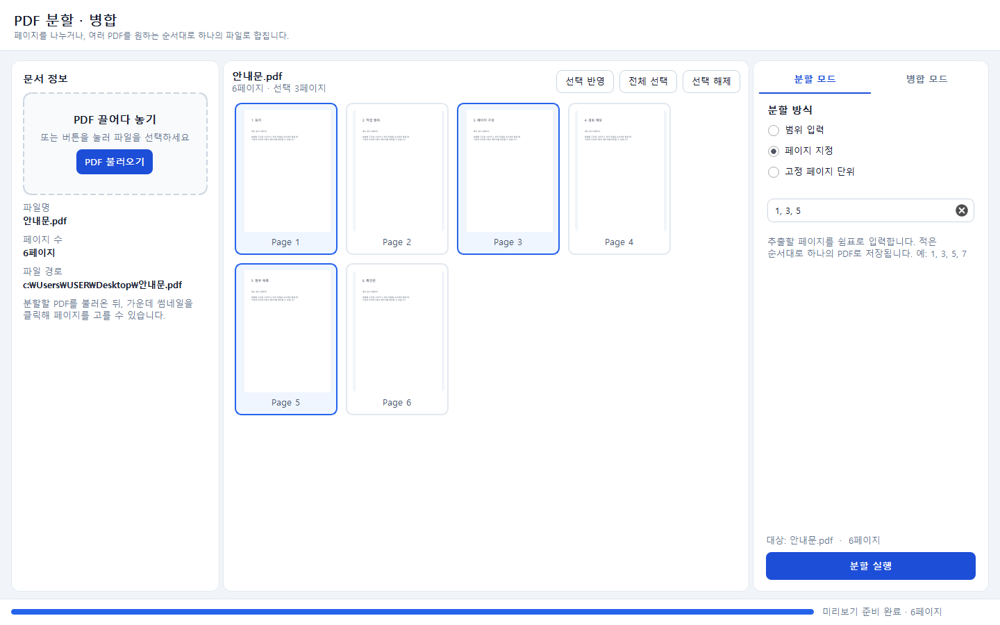
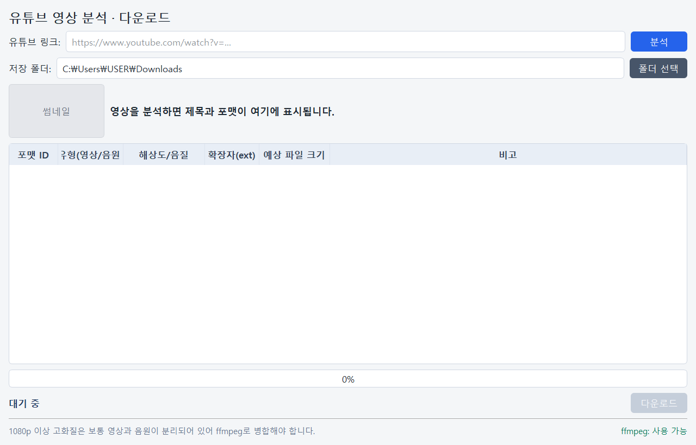
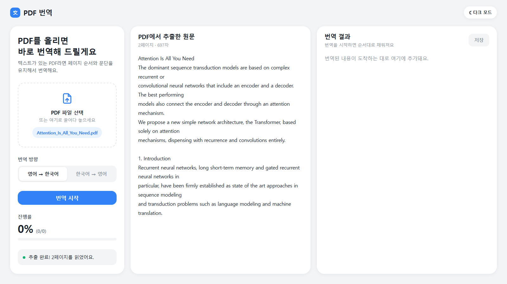
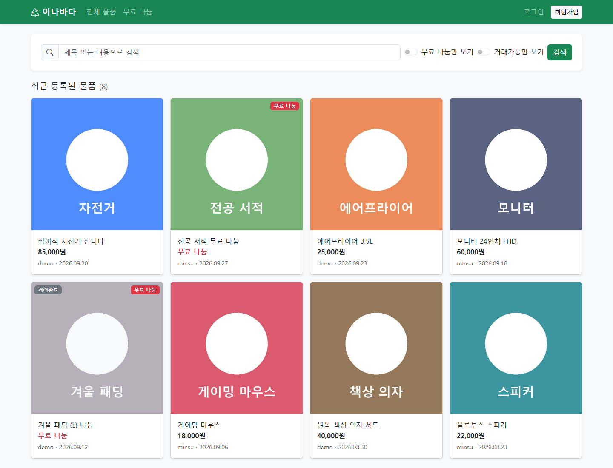
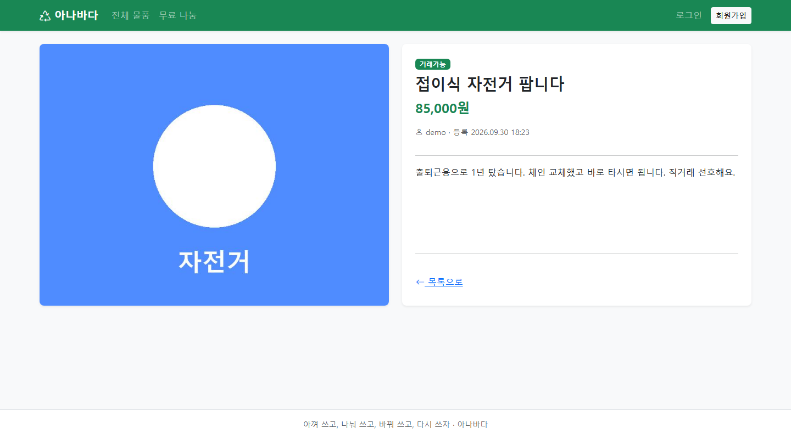

# lges-ai-agent-lab

수업 중 만든 소규모 앱 모음. 폴더당 앱 1개, 전체 Python으로 구현.

| 폴더 | 내용 |
| --- | --- |
| `pdf_split&merge` | PDF 분할·병합 (데스크톱) |
| `yt_download` | 유튜브 영상 분석·다운로드 (데스크톱) |
| `pdf_translation/pdf-translator` | PDF 영↔한 번역 (웹) |
| `anabada` | 중고 물품 거래 게시판 (웹, 실습 중) |
| `video_image_analysis` | 이미지·웹캠 사물 인식 (웹) |
| `recomm_food` | 냉장고 재료 기반 요리 추천 (웹) |
| `local_rag` | 로컬 PDF RAG 질의응답 (웹) |
| `contract_review` | LLM 기반 계약서 검토 (웹) |

---

## PDF 분할 · 병합

PDF 페이지 분할, 여러 PDF 순서 지정 병합. PyQt5 기반 데스크톱 앱.



- PDF 드래그 앤 드롭 시 페이지 썸네일 표시, 썸네일 클릭으로 페이지 선택
- 분할 방식 3종: 범위 입력(`1-5, 8-10`), 페이지 지정(`1, 3, 5`), N페이지 단위
- 병합: 목록에서 순서 변경 후 저장
- 암호 설정된 PDF는 열 때 비밀번호 입력

```text
cd "pdf_split&merge"
pip install -r requirements.txt
python app.py
```

## 유튜브 영상 분석 · 다운로드

링크 분석 후 포맷 선택 다운로드. PyQt5 + yt-dlp 기반 데스크톱 앱.



- 분석 결과를 표로 표시: 포맷 ID, 영상/음원 구분, 해상도, 확장자, 예상 용량
- 720p 이하: 영상·음원이 한 파일인 포맷이 많음
- 1080p 이상: 영상·음원 분리 포맷, ffmpeg 병합 필요 (ffmpeg 없으면 해당 포맷 다운로드 불가)

```text
cd yt_download
pip install -r requirements.txt
python main.py
```

**ffmpeg 설치**

- [gyan.dev](https://www.gyan.dev/ffmpeg/builds/)에서 release essentials 다운로드 후 압축 해제
- `ffmpeg.exe`가 있는 `bin` 폴더를 PATH에 추가, `ffmpeg -version`으로 확인
- PATH 미사용 시 `ffmpeg.exe`, `ffprobe.exe`를 `main.py`와 같은 폴더에 배치
- 실행 화면 하단에 `ffmpeg: 사용 가능` 표시되면 정상

## PDF 번역

PDF 텍스트 추출 후 OpenAI로 번역. Flask 기반 웹 앱, 영→한·한→영 지원.



- 왼쪽: PDF 업로드, 번역 방향 선택, `번역 시작`
- 가운데: PDF 추출 원문 / 오른쪽: 번역 결과
- 조각 단위로 번역 결과를 실시간 반영, 진행률 표시 (SSE)
- 완료 후 `저장`으로 원본 파일명과 같은 `.txt` 다운로드
- 긴 페이지는 문단 기준 분할 후 요청, 실패 시 최대 2회 재시도, 계속 실패하면 해당 구간만 오류 표시 후 진행
- 다크 모드 지원
- 제한: 스캔본(이미지 PDF) 미지원, 업로드 최대 50MB

실행 전 `OPENAI_API_KEY` 환경 변수 설정 필요. 미설정 시 화면 상단에 안내가 표시되고 번역 버튼 비활성화.

```text
cd pdf_translation/pdf-translator
pip install -r requirements.txt
set OPENAI_API_KEY=여기에_키
python app.py
```

- PowerShell: `$env:OPENAI_API_KEY="여기에_키"`
- 접속: http://127.0.0.1:5000
- 기본 모델 `gpt-4o-mini`, `OPENAI_MODEL` 환경 변수로 변경 가능

## anabada (중고 물품 거래)

물품 등록·검색·거래 상태 관리 게시판. Flask + SQLite 기반 웹 앱, 실습 진행 중으로 기능 추가 예정.





※ 화면은 연습용 샘플 데이터 기준.

- 회원가입, 로그인, 로그인 유지(remember me)
- 물품 등록: 제목, 설명, 가격, 사진 (`무료 나눔` 선택 가능, png/jpg/jpeg/gif/webp, 최대 5MB)
- 목록: 제목·설명 검색, 무료 나눔만 보기, 거래완료 숨기기, 페이지당 12개
- 수정·삭제·`거래가능`/`거래완료` 상태 변경은 작성자만 가능, 타인 접근 시 403
- `내 물품`: 본인 등록 물품 모아보기
- 모든 POST 요청 CSRF 토큰 검증

```text
cd anabada
pip install -r requirements.txt
python app.py
```

- 접속: http://127.0.0.1:5000
- DB(`anabada.db`), 업로드 사진은 최초 실행 시 자동 생성, Git 제외
- 운영 시 `SECRET_KEY` 환경 변수 지정 필요 (미지정 시 개발용 기본값 사용)

## 사물 인식 (이미지 · 웹캠)

YOLO11n 기반 객체 탐지. Gradio UI, Ultralytics 탐지, OpenCV 박스 렌더링.

- 화면 좌우 분할: 왼쪽 이미지, 오른쪽 웹캠
- 이미지 업로드 시 하단에 결과 표시: 탐지 객체별 박스, 이름, 신뢰도(0~1)
- 웹캠 실행 시 프레임마다 탐지, 박스 오버레이 영상 실시간 출력
- 신뢰도 0.25 미만 제외, 탐지 대상은 COCO 80개 클래스(사람, 자동차, 컵 등)

```text
cd video_image_analysis
pip install -r requirements.txt
python app.py
```

- 접속: http://127.0.0.1:7860
- 최초 실행 시 모델 파일(`yolo11n.pt`, 약 5MB) 자동 다운로드, Git 제외
- 포트 변경: `VISION_PORT` 환경 변수
- 웹캠 사용 시 브라우저 카메라 권한 허용 필요

## 냉장고 재료 요리 추천

보유 재료 입력 시 직접 구축한 레시피 100개 중 만들 수 있는 요리 추천. Streamlit UI, LangChain + Chroma 검색, OpenAI 설명 생성.

- 재료 입력: 자동완성 멀티셀렉트, 목록에 없는 재료 직접 입력 가능
- 동의어 자동 변환 (`달걀`→`계란`, `쪽파`→`대파`, `표고버섯`→`버섯` 등)
- 결과 2묶음: `지금 바로 만들 수 있어요`(부족 0개), `1~2개만 더 있으면 돼요`(부족 재료 표시)
- 사이드바 양념 체크리스트: 체크된 양념은 보유로 간주, 체크 해제 시 부족 재료로 집계
- 추천 순서: 부족 재료 수 오름차순, 주재료 일치율 내림차순
- 판정·순위는 코드 계산, LLM은 추천 이유·대체 재료 설명만 담당 (설명 실패 시 추천 목록만 표시)
- 요리 카드: 카테고리, 조리 시간, 난이도, 일치율, 재료·조리 순서 펼쳐보기

실행 전 `OPENAI_API_KEY` 환경 변수 설정 필요. 미설정 시 화면에 안내 표시 후 중단.

```text
cd recomm_food
pip install -r requirements.txt
python -m streamlit run app.py
```

- 접속: http://localhost:8501
- 최초 실행 시 레시피 인덱스(`chroma_db/`) 자동 생성, Git 제외
- `data/recipes.json` 수정 후 `python build_index.py`로 인덱스 재생성
- 테스트: `pip install pytest` 후 `python -m pytest` (OpenAI 호출 없음)
- 모델: 설명 `gpt-4o-mini`, 임베딩 `text-embedding-3-small`

## 로컬 PDF RAG

업로드한 PDF 내용만 근거로 질의응답. Flask 3.1.3 웹 앱, LangChain 1.3.11 + Chroma 1.1.1 검색, 로컬 LLM·임베딩.

- 왼쪽: PDF 다중 업로드, 업로드된 문서 목록, `새 대화`
- 오른쪽: 문서 기반 채팅. 관련 청크가 없거나 거리 `0.50` 초과 시 `정보가 없어서 답변할 수 없습니다`
- 답변에 근거 문서명·페이지 표시. 같은 파일명 재업로드 시 기존 청크 교체
- 청크: 500자, 겹침 100자, 검색 `k=4`
- 대화 이력 최근 6턴 유지, 검색 질의에는 직전 사용자 질문 2개까지 포함
- 제한: PDF만, 업로드 최대 200MB, 스캔본(이미지 PDF)은 텍스트 추출 실패 가능
- CPU 전용. LLM GPU 레이어 사용 안 함 (`n_gpu_layers=0`)

모델 파일은 `local_rag/models/`에 두고 Git에는 올리지 않음.

| 역할 | 모델 | 버전 |
| --- | --- | --- |
| LLM | EXAONE-3.5-2.4B-Instruct | GGUF `Q5_K_M`, llama-cpp-python `0.3.33` |
| 임베딩 | BGE-M3 | sentence-transformers `5.6.0`, 로컬 체크포인트 |

```text
cd local_rag
pip install -r requirements.txt
python app.py
```

- 접속: http://127.0.0.1:5000
- LLM: `models/exaone_2.4b/EXAONE-3.5-2.4B-Instruct-Q5_K_M.gguf`
- 임베딩: `models/bge-m3/`
- 업로드 PDF(`uploads/`), 인덱스(`chroma_db/`)는 실행 중 생성, Git 제외
- 컨텍스트 `4096`, 생성 토큰 최대 `512`, temperature `0.2`

## 계약서 검토

가이드라인 PDF를 검색 근거로 두고, 계약서 문장의 위배·보완을 고쳐 보여주는 웹. Flask, LangChain, Chroma, gpt-4o-mini.

- 왼쪽: `RAG 파일 업로드`(PDF 여러 개), `계약서 업로드`, 업로드가 끝나면 `계약서 검토`
- 오른쪽: 검토 결과. 하단 질문창의 일반 질문은 문서 검색 없이 모델에 직접 요청
- 업로드·검토 중 tqdm 진행률을 답변 영역에 표시. 검토 문장은 한 건씩 추가
- 가이드라인 분할: 30자, 겹침 5자. 계약서 분할: 30자, 겹침 없음. 구분자 `\n`, `\n\n`
- 줄바꿈이 없는 긴 문장은 글자 수로 다시 자르지 않고 한 덩어리로 검토
- 임베딩 `text-embedding-3-small`, 검토·일반 질문 `gpt-4o-mini`
- 위배 문장은 `[원문]` 바로 아래에 `[수정문구]`를 진한 파란색으로 표시. 이상 없으면 원문만 표시
- 문장 판정은 유사 가이드라인 검색 1회와 모델 호출 1회

실행 전 `OPENAI_API_KEY` 환경 변수 필요. 코드에서 키를 넣지 않음.

```text
cd contract_review
pip install -r requirements.txt
python app.py
```

- 접속: http://127.0.0.1:5050
- 업로드(`uploads/`), 인덱스(`chroma_db/`)는 실행 중 생성, Git 제외
- 테스트: `python -m unittest discover -s tests` (OpenAI 호출 없음)
- 제한: PDF만, 업로드 최대 50MB, 스캔본은 텍스트 추출 실패 가능
- 패키지 버전은 현재 환경 기준. LangChain `1.3.11`
